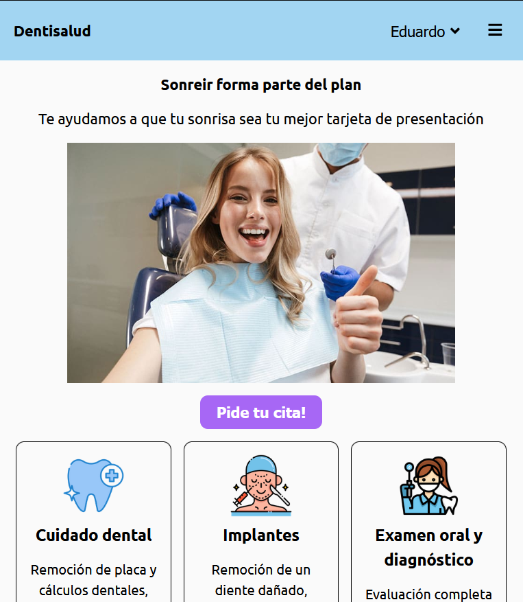
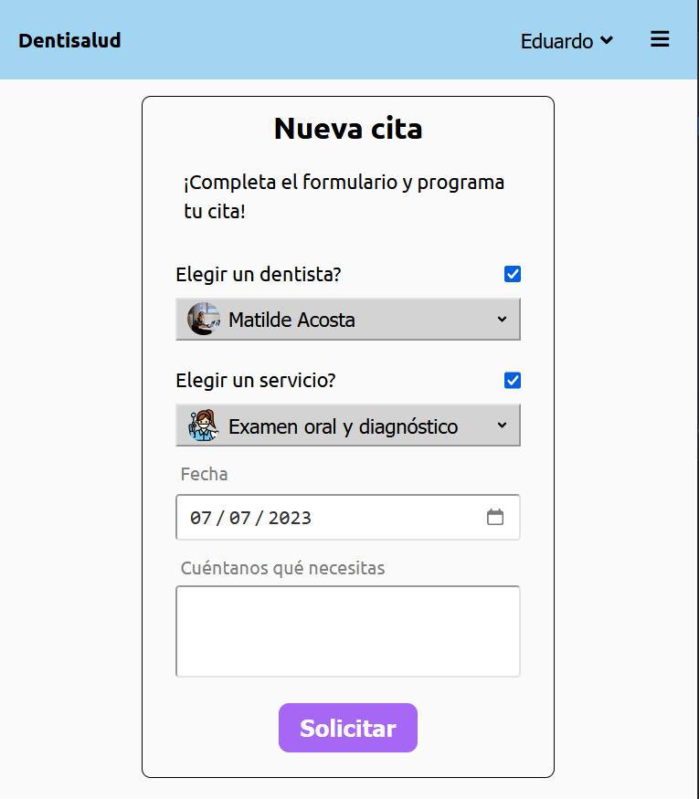
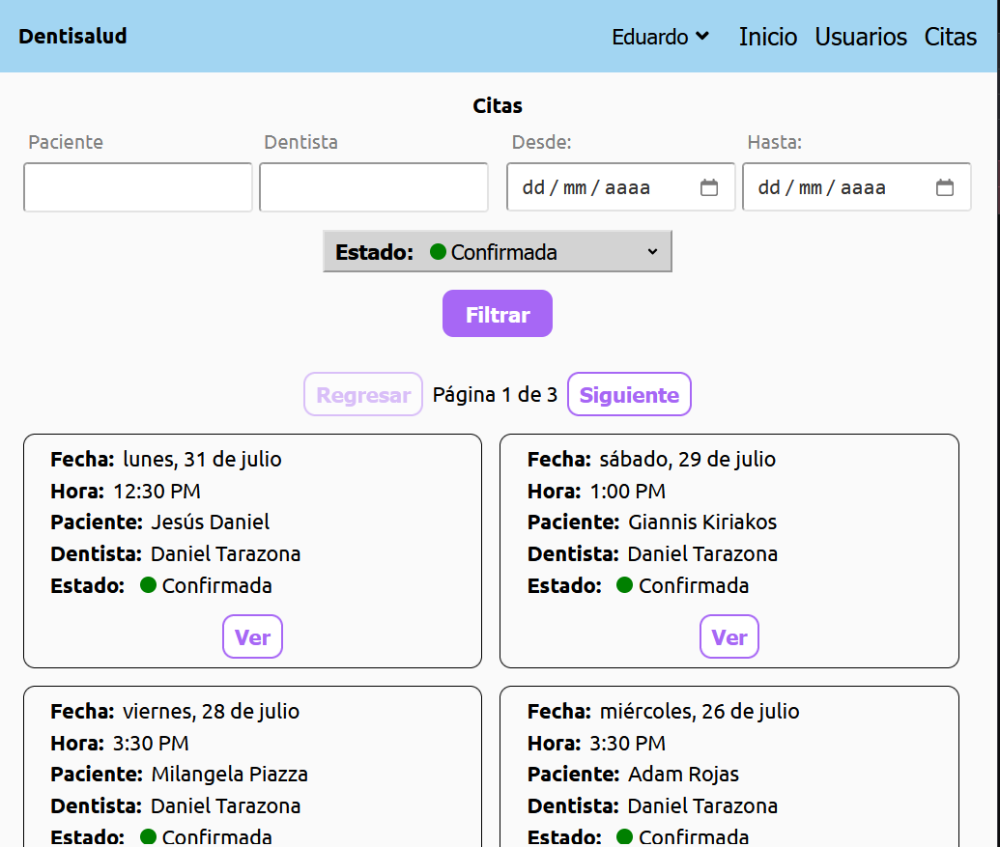

# Dental Clinic Frontend

This is the frontend repository for a dental clinic web application built with React, which interacts with the [dental-api](https://github.com/Edkiri/dental-api).

## Features

- User authentication and authorization as patient, dentist and admin.
- Treatments listing without authentication.

### Patient
- Patient can create and update profile.
- Patient can request appointments.
- Patient can list, update, and cancel appointments.
- Patient can choose dentist and treatment.

  
### Dentist
- Schedule their appointments.
- Filter appointments by patient name, datetime, and status.
- Can confirm or cancel appointments.

### Admin
- Can confirm or cancel appointments.
- List all appointments.
- Filter appointments by patient name, dentist name, start-end datetime, and status.
- List all registered users.

## Technologies Used

- React.
- React Router.
- React Context.
- Axios.
- CSS.